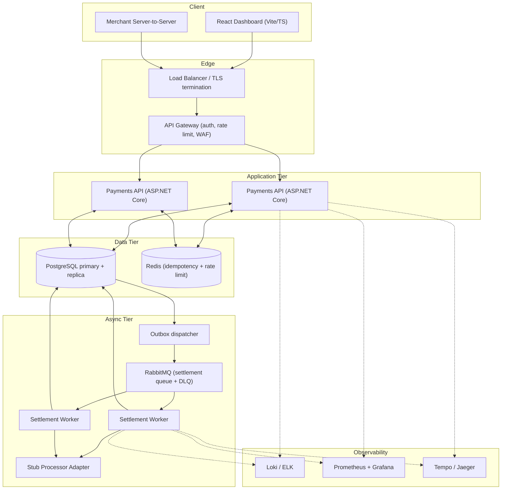

# Plan: Payment Processing Platform

**Source brief**: /Users/evangarcia/Programing/Argyle - Payment Processing Platform/Payment-Platform-Exercise.md
**Complexity**: Large (designed enterprise, built focused-slice)

## 1. Summary
We are building a payment processing platform: a .NET 8 ASP.NET Core Web API, a React + Vite + TypeScript dashboard, and one background worker that moves payments from `Captured` to `Settled`. The headline architectural choice is a **state-machine-driven payment aggregate with an append-only event audit table, processed by an outbox-fed RabbitMQ worker**. That gives us correct state transitions, a perfect audit trail, and a settlement workflow that is observable, retry-safe, and traceable end-to-end.

## 2. Scale & Audience Assumptions

| Dimension | Target | Why |
|---|---|---|
| Merchants | ~500 active | Mid-to-large enterprise, not consumer scale |
| Peak request rate | 200 req/s on `POST /payments` | Black Friday-shaped peak for B2B merchants |
| Steady-state | 30–50 req/s | Typical business hours |
| Payments / month | ~5 million | 500 merchants × 10K payments/month average |
| API p99 latency | < 300ms for create/get | Industry baseline for synchronous payment APIs |
| Settlement throughput | ~2,000 settlements/min | Batched off-hours plus rolling intraday |
| Data retention | 7 years for payments + events | Common financial record retention requirement |
| Availability target | 99.99% (~52 min/year) | Multi-region active-passive is the floor for enterprise payments; single-region is acceptable only for the exercise |

We picked these numbers because they're representative of an enterprise payments tenant: large enough that naive designs break (no in-memory state, no string-key locks, no single-row hotspots), but small enough that a single primary Postgres + a single RabbitMQ broker is a defensible starting point. Designs should hold up to ~10× this load before requiring sharding.

## 3. Target Enterprise Architecture (the full picture)



**What each box does (plain language):**

- **Load balancer + API gateway.** Terminates TLS, checks the merchant's auth token, throttles abusive callers, and forwards good traffic. In production this is something like NGINX or Azure Front Door plus an APIM layer.
- **Payments API (ASP.NET Core).** The stateless request handlers. Two or more instances behind the load balancer. Every payment mutation goes through here.
- **PostgreSQL.** The source of truth. Primary handles writes; a read replica handles dashboard list/search queries. We pick Postgres because we get real ACID transactions, strong constraints (we'll lean on a CHECK constraint for the state column and a unique index for idempotency keys), JSONB for flexible event payloads, and excellent .NET support via Npgsql/EF Core.
- **Redis.** Hot cache for idempotency lookups (the API checks Redis before hitting the DB) and a place to count request rates for per-merchant throttling.
- **Outbox dispatcher.** Reads rows from a `payment_outbox` table inside the same DB transaction that mutates the payment, then publishes them to RabbitMQ. This is the standard fix for the "I wrote to the DB but the queue publish failed" race. **Idempotency** here means: if we deliver the same message twice, the consumer must produce the same result — the dispatcher does not need to be exactly-once because the worker is idempotent (see §7).
- **RabbitMQ.** The message broker. Holds settlement jobs and routes failures to a dead-letter queue (**DLQ** = a separate queue that holds messages we couldn't process so a human can inspect them). We pick RabbitMQ over a cloud-native broker because it runs identically on a laptop and in production, has first-class .NET support (MassTransit), and gives us per-message ack/nack semantics that fit settlement work.
- **Settlement workers.** Multiple consumer instances. Each pulls a job, calls the stub processor, updates the payment, and acks the message. Idempotent so we can replay safely.
- **Stub processor adapter.** A hidden seam behind an `IPaymentProcessor` interface. In the exercise it's a deterministic stub. In production it's Stripe, Adyen, or a card scheme gateway.
- **Observability stack.** Structured logs go to a log store, RED metrics (Rate/Errors/Duration) plus business metrics go to Prometheus, and traces go to Tempo/Jaeger. All three are correlated by trace ID.
- **Auth model.** Two tiers. Merchant server-to-server requests authenticate with **OAuth2 client credentials** (the merchant exchanges a client ID + secret for a short-lived bearer token). Human users on the dashboard authenticate via **OIDC** (federated to the merchant's IdP for SSO). Every token carries a `merchant_id` claim that the API uses for tenancy isolation on every query.

## 4. Exercise Scope (what we actually build)

**In scope (built):**
- ASP.NET Core 8 Web API with `POST /payments`, `GET /payments/{id}`, `POST /payments/{id}/capture`, `POST /payments/{id}/refund`, `GET /payments` (list + filter).
- PostgreSQL via EF Core with `Payment`, `PaymentEvent`, `IdempotencyKey`, `Merchant`, `PaymentOutbox` tables.
- Idempotency on create, capture, and refund using an `Idempotency-Key` header.
- Settlement worker as a .NET `BackgroundService` (one process, scalable horizontally) consuming RabbitMQ via MassTransit, with retry + DLQ.
- Transactional outbox pattern from API → RabbitMQ.
- React + Vite + TypeScript dashboard: list view with filter, detail view showing state and event timeline.
- Structured logging with Serilog (JSON sink), correlation ID middleware.
- OpenTelemetry SDK instrumented across API + worker. Console exporter wired by default; OTLP exporter configurable but optional.
- Prometheus metrics endpoint exposing RED + business metrics + queue depth.
- `/health/live` and `/health/ready` endpoints.
- A simple bearer-token auth scheme with a static dev key per merchant. Real OAuth2 is documented but stubbed.
- Docker Compose for local run (API, worker, Postgres, RabbitMQ, Prometheus, Grafana optional).

**Out of scope (documented, not built):**

| Out | How we'd add it |
|---|---|
| Real OAuth2 / OIDC | Swap the dev bearer middleware for `Microsoft.AspNetCore.Authentication.JwtBearer` pointed at an IdP |
| Real card data / PCI vault | Add a tokenization service in front of the API; payment endpoints only ever see opaque tokens |
| Webhook delivery | Reuse the outbox + worker pattern with a new queue and an HTTP delivery worker |
| Real settlement against a card network | Replace the stub `IPaymentProcessor` with an adapter implementation |
| Multi-region / DR | Add streaming replication, cross-region RabbitMQ federation, traffic manager failover |
| Rate limiting beyond a single instance | Move from in-memory token bucket to Redis-backed sliding window |
| Read replica routing | Add a second EF DbContext bound to the replica for list/search endpoints |
| Admin UI for DLQ inspection | Small internal tool that reads the DLQ and exposes requeue/discard actions |

## 5. Payment Lifecycle & State Machine

**States in plain language:**

- **Pending.** We accepted the request. We have not yet asked the processor to authorize the card. This is the initial state immediately after `POST /payments`.
- **Authorized.** The processor has reserved the funds on the customer's card. Money has not moved yet. The merchant can now decide to capture or void.
- **Captured.** The merchant told us to actually take the money. The processor has agreed to move funds. Funds are still in flight.
- **Settled.** The funds have actually landed in the merchant's account. This happens after a delay (often hours or days). The settlement worker drives this transition.
- **Failed.** Terminal. Something rejected the payment (authorization declined, processor error, validation failure). The event log explains why.
- **Refunded.** Terminal. The captured funds were returned to the customer.

**Allowed transitions:**

```
Pending ──auth ok──▶ Authorized ──capture──▶ Captured ──settle──▶ Settled
   │                     │                       │
   │                     │                       └──refund──▶ Refunded
   │                     │
   └──auth fail──▶ Failed
                         └──void/fail──▶ Failed
```

Transitions are validated server-side. The state column has a CHECK constraint and the application layer rejects illegal transitions with `409 Conflict`. Every transition appends a row to `PaymentEvent`.

**Idempotency (plain language).** Idempotency means: if the merchant sends the same request twice, we do the work once and return the same answer both times. We do this with an `Idempotency-Key` header (the merchant generates a UUID per logical operation).

- **Storage.** A row in the `IdempotencyKey` table with `(merchant_id, key)` as a unique constraint, plus the request hash and the cached response body + status code.
- **On first call.** We claim the key inside the same DB transaction that creates the payment. If the claim succeeds, we proceed; the response is written back into the row at the end.
- **On retry with same key + same request body.** We return the cached response. No work happens.
- **On retry with same key + different request body.** We return `409 Conflict` (the merchant is using the key wrong).
- **TTL.** 24 hours for cached responses. After that, the key is reusable.

This applies to `POST /payments`, `POST /payments/{id}/capture`, and `POST /payments/{id}/refund`.

## 6. API Design

All endpoints are under `/v1`. All responses are JSON. All errors share one envelope.

**Error envelope:**
```json
{
  "error": {
    "code": "payment_not_found",
    "message": "Human-readable explanation.",
    "details": { "payment_id": "pay_abc123" },
    "trace_id": "00-abc...-01",
    "request_id": "req_xyz"
  }
}
```

Error codes are stable, snake_case, and documented. Status codes follow REST conventions: 400 (validation), 401 (auth), 403 (tenancy), 404 (missing), 409 (state conflict / idempotency mismatch), 422 (unprocessable business rule), 429 (rate limit), 500 (us).

**Endpoints:**

| Method | Path | What it does | Key request fields | Response |
|---|---|---|---|---|
| POST | `/v1/payments` | Create a payment in `Pending`, kick off async auth | `amount_minor`, `currency`, `customer_reference`, `card_token` (stub), `metadata` | `201` with `Payment` |
| GET | `/v1/payments/{id}` | Fetch one payment | — | `200` with `Payment` (includes `events[]`) |
| POST | `/v1/payments/{id}/capture` | Move `Authorized` → `Captured` | `amount_minor` (optional, defaults to full) | `200` with `Payment` |
| POST | `/v1/payments/{id}/refund` | Move `Captured`/`Settled` → `Refunded` | `amount_minor`, `reason` | `200` with `Payment` |
| GET | `/v1/payments` | List + filter | query: `status`, `merchant_reference`, `created_after`, `created_before`, `limit`, `cursor` | `200` with `{ data, next_cursor }` |
| GET | `/health/live` | Liveness | — | `200` |
| GET | `/health/ready` | Readiness (DB + MQ reachable) | — | `200` / `503` |
| GET | `/metrics` | Prometheus scrape | — | text/plain |

**Idempotency header.** `Idempotency-Key: <uuid>` is **required** on all `POST` endpoints. Missing header → `400`. Mismatched body on a known key → `409`.

**Pagination.** Opaque cursor (base64-encoded `(created_at, id)` tuple). No offset pagination — that breaks for high-write tables at scale.

**Payment shape:**
```json
{
  "id": "pay_01HXYZ...",
  "merchant_id": "mrc_...",
  "status": "Authorized",
  "amount_minor": 12500,
  "currency": "USD",
  "customer_reference": "order-4421",
  "metadata": { "...": "..." },
  "created_at": "2026-06-05T12:34:56Z",
  "updated_at": "2026-06-05T12:34:57Z",
  "events": [
    { "from": null, "to": "Pending", "at": "...", "actor": "api", "reason": "created" },
    { "from": "Pending", "to": "Authorized", "at": "...", "actor": "processor_stub", "reason": "auth_ok" }
  ]
}
```

## 7. Async Workflow

**We build settlement.** It's the workflow that most naturally exercises queues, retries, state transitions, and the audit trail. Webhook delivery is structurally similar but covers less ground; reconciliation needs a real upstream to be meaningful.

**Trigger.** When a payment moves to `Captured`, the API writes a row to `payment_outbox` in the **same DB transaction**. A dispatcher reads new outbox rows and publishes a `SettlePayment` message to RabbitMQ. This is the **outbox pattern**: it guarantees we never have a captured payment without a queued settlement job, and never a queued job for a payment that didn't capture.

**Queue message:**
```json
{
  "message_id": "msg_...",
  "payment_id": "pay_...",
  "merchant_id": "mrc_...",
  "correlation_id": "<trace_id>",
  "attempt": 1,
  "enqueued_at": "..."
}
```

The correlation_id is the OpenTelemetry trace ID from the original API request. The worker uses it to continue the same trace, so a single payment shows up as one connected story across the API span and the worker span.

**Retries.** Handled by MassTransit's retry policy:
- 5 attempts with exponential backoff: 1s, 4s, 16s, 64s, 256s.
- Retries happen in-process (the message stays unacked).
- Transient failures (network timeout, processor 5xx) are retried.
- Permanent failures (payment already settled, payment refunded, validation error) short-circuit and ack immediately — no retry.

**Dead-letter handling.** After 5 failed attempts, MassTransit moves the message to `settlement.dlq`. DLQ entries are visible in Grafana via a `queue_depth{queue="settlement.dlq"}` metric. The runbook says: open the dashboard, inspect the message + correlation ID, trace the failure, fix root cause, requeue or discard via the admin tool (admin tool itself is out of scope for the exercise — for the exercise we'd document the manual `rabbitmqctl` command).

**Idempotent processing.** The worker:
1. Loads the payment by ID with a `FOR UPDATE` row lock.
2. Checks the current state. If already `Settled`, acks and exits — this is what makes duplicate delivery safe.
3. If `Captured`, calls the stub processor.
4. On success, updates state to `Settled`, appends a `PaymentEvent`, commits the transaction, acks the message.
5. On transient failure, throws and lets MassTransit handle retry.

**Correlation.** Every log line from the API request and every log line from the worker include the same `trace_id` and `payment_id`. Pull all logs by trace_id and you get the full story: who created the payment, when it captured, when settlement was enqueued, every retry attempt, and the final outcome.

## 8. Data Model

PostgreSQL. All IDs are ULIDs with a prefix (`pay_`, `mrc_`, `evt_`). All timestamps are `timestamptz`.

**`merchants`**
| Column | Type | Notes |
|---|---|---|
| id | text PK | `mrc_...` |
| name | text | |
| api_key_hash | text | hashed dev key for the exercise |
| created_at | timestamptz | |

**`payments`**
| Column | Type | Notes |
|---|---|---|
| id | text PK | `pay_...` |
| merchant_id | text FK | indexed |
| status | text | CHECK in (Pending, Authorized, Captured, Settled, Failed, Refunded) |
| amount_minor | bigint | smallest currency unit |
| currency | char(3) | ISO 4217 |
| customer_reference | text | nullable |
| card_token | text | stub token, never raw PAN |
| metadata | jsonb | |
| created_at | timestamptz | |
| updated_at | timestamptz | |
| version | int | optimistic concurrency |

Indexes:
- `(merchant_id, created_at desc, id desc)` — drives list/search and cursor pagination.
- `(merchant_id, status)` — filter by status.
- `(merchant_id, customer_reference)` — search by merchant reference.

**`payment_events`** (append-only audit trail)
| Column | Type | Notes |
|---|---|---|
| id | text PK | `evt_...` |
| payment_id | text FK | indexed |
| from_status | text | nullable on creation |
| to_status | text | |
| actor | text | `api`, `worker`, `processor_stub`, `system` |
| reason | text | short code |
| payload | jsonb | optional context |
| at | timestamptz | indexed |

We never UPDATE this table. It's the audit log.

**`idempotency_keys`**
| Column | Type | Notes |
|---|---|---|
| merchant_id | text | composite PK |
| key | text | composite PK |
| request_hash | text | SHA-256 of canonicalized body |
| response_status | int | |
| response_body | jsonb | |
| created_at | timestamptz | indexed for TTL sweep |

Unique constraint on `(merchant_id, key)`. A nightly job purges rows older than 24h.

**`payment_outbox`**
| Column | Type | Notes |
|---|---|---|
| id | bigserial PK | |
| aggregate_id | text | `payment_id` |
| message_type | text | e.g. `SettlePayment` |
| payload | jsonb | |
| created_at | timestamptz | |
| dispatched_at | timestamptz | nullable; null = not yet sent |

Partial index on `(created_at)` WHERE `dispatched_at IS NULL` — keeps the dispatcher poll cheap.

## 9. Observability Plan

| Requirement | Tool | Wired? | What gets instrumented |
|---|---|---|---|
| Structured logs | **Serilog** with JSON formatter | Wired | Every request, every state transition, every queue publish/consume. Enricher adds `trace_id`, `span_id`, `merchant_id`, `payment_id`, `correlation_id`. |
| Log redaction | Custom Serilog enricher | Wired | Strips `card_token`, `cvv`, and any field listed in a deny list. No PAN ever reaches a logger. |
| Correlation ID | ASP.NET middleware + MassTransit filter | Wired | Middleware reads/creates `X-Request-Id`, pushes to `Activity.Current.Baggage` and Serilog context. Worker reads it back from the message envelope. |
| Distributed tracing | **OpenTelemetry .NET SDK** + ASP.NET, HttpClient, Npgsql, MassTransit instrumentations | Wired (console exporter); OTLP exporter configurable | API HTTP spans, DB query spans, queue publish/consume spans, processor call spans. |
| Metrics — RED | **prometheus-net** + OpenTelemetry metrics | Wired | `http_requests_total{route,status}`, `http_request_duration_seconds`, `http_request_errors_total`. |
| Metrics — business | Custom counters/gauges | Wired | `payments_created_total{currency}`, `payments_by_status{status}`, `payments_failed_total{reason}`, `refunds_total`. |
| Metrics — queue | MassTransit + custom gauge | Wired | `mq_queue_depth{queue}`, `mq_processing_lag_seconds`, `mq_retries_total{queue}`, `mq_deadletter_total{queue}`. |
| Health / readiness | `Microsoft.Extensions.Diagnostics.HealthChecks` | Wired | `/health/live` returns 200 always once started. `/health/ready` checks DB connection + RabbitMQ connection. |
| Audit trail | `payment_events` table | Wired | Surfaced in the dashboard detail view. |
| Error handling | ASP.NET `ProblemDetails` + custom exception middleware | Wired | All errors funnel through the consistent envelope from §6. |

**Stubbed vs wired (explicit):**
- **Wired:** Serilog JSON to stdout. OpenTelemetry SDK with console exporter. Prometheus scrape endpoint. Health checks. All business metrics. Trace propagation API → MQ → worker.
- **Stubbed (config exists, not pointed anywhere by default):** OTLP exporter for traces/metrics (would point at Tempo/Otel Collector in prod). Loki/ELK log sink (we log to stdout; in prod a sidecar ships it). Grafana dashboards are documented but not bundled.

## 10. Security & PCI Posture

**What we do:**
- TLS terminated at the edge in production; HTTPS dev profile locally with a self-signed cert.
- Bearer token auth on every endpoint except `/health/*` and `/metrics`.
- Per-merchant tenancy: every DB query is filtered by `merchant_id` from the token. No exception.
- Input validation via FluentValidation at the controller boundary. Reject early with clear error codes.
- Parameterized queries everywhere via EF Core — no string-concat SQL.
- Secrets via environment variables in the exercise. In production: Azure Key Vault or HashiCorp Vault.
- Rate limiting per merchant via ASP.NET's built-in `RateLimiter` middleware (fixed window in the exercise, sliding window in prod).
- Logs and metrics never contain card data, secrets, or tokens.

**What we deliberately don't do (and why):**
- **We do not store real card numbers (PANs).** The API accepts a `card_token` that is a stub identifier. In production, a tokenization vault sits in front and the payments service never sees raw PAN. This keeps us out of PCI DSS scope.
- **We do not implement CVV handling.** Same reason.
- **We do not implement real OAuth2 in the exercise.** The dev bearer scheme is a one-line swap for `JwtBearer` middleware.

**Why this still demonstrates PCI mindset.** PCI DSS is mostly about minimizing where card data lives. The architecture we describe puts the tokenization vault in a separate trust zone, keeps the payment service free of card data, and logs nothing sensitive. The seams for that posture are present in the exercise code; the vault itself is documented.

## 11. Repository Structure

Monorepo. Single repo is easier to evaluate, lets us share types and contracts, and is what most enterprise payments teams actually run.

**Backend pattern: Vertical Slice Architecture.** We organize by feature (CreatePayment, CapturePayment, RefundPayment, SettlePayment) rather than by horizontal layer (Controllers/, Services/, Repositories/). This keeps cohesion high — everything for one operation sits next to itself — and it matches how the team will actually navigate the code when triaging a bug. We use MediatR to wire request → handler so each slice is a single small command + handler + validator + endpoint.

```
/payment-platform
├── README.md
├── docker-compose.yml
├── .editorconfig
├── /docs
│   ├── architecture.md
│   ├── runbook-settlement.md
│   └── adr/
│       ├── 0001-postgres-as-store-of-record.md
│       ├── 0002-rabbitmq-over-azure-service-bus.md
│       ├── 0003-outbox-pattern-for-reliability.md
│       └── 0004-vertical-slice-architecture.md
├── /backend
│   ├── PaymentPlatform.sln
│   ├── /src
│   │   ├── /PaymentPlatform.Api          # ASP.NET Core entry point, DI, middleware
│   │   ├── /PaymentPlatform.Application  # Vertical slices (features), validators, abstractions
│   │   │   └── /Features
│   │   │       ├── /CreatePayment
│   │   │       ├── /CapturePayment
│   │   │       ├── /RefundPayment
│   │   │       ├── /GetPayment
│   │   │       └── /ListPayments
│   │   ├── /PaymentPlatform.Domain       # Payment aggregate, state machine, events
│   │   ├── /PaymentPlatform.Infrastructure  # EF Core, Npgsql, Redis, MassTransit, Serilog
│   │   ├── /PaymentPlatform.Worker       # BackgroundService host for settlement
│   │   └── /PaymentPlatform.Contracts    # DTOs shared across API/worker/(typegen for frontend)
│   └── /tests
│       ├── /PaymentPlatform.UnitTests
│       ├── /PaymentPlatform.IntegrationTests   # Testcontainers: real Postgres + RabbitMQ
│       └── /PaymentPlatform.ContractTests
├── /frontend
│   ├── package.json
│   ├── vite.config.ts
│   ├── tsconfig.json
│   └── /src
│       ├── /features
│       │   ├── /payments-list
│       │   ├── /payment-detail
│       │   └── /filters
│       ├── /components/ui
│       ├── /hooks
│       ├── /lib                   # api client, formatters, types
│       └── /styles
└── /ops
    ├── grafana-dashboards/        # JSON dashboards (documented, not auto-loaded)
    ├── prometheus.yml
    └── otel-collector-config.yaml # stubbed
```

## 12. Testing Strategy

Target: **80% line coverage on backend, 70% on frontend**, but coverage is a smell test, not the goal. The goal is: every state transition, every idempotency path, and every retry path has a deterministic test.

**Unit tests (xUnit + FluentAssertions):**
- Domain layer: the `Payment` aggregate's state machine. One test per legal transition, one test per illegal transition (expects exception). This is the single highest-value test file in the codebase.
- Validators: each FluentValidation rule.
- Idempotency hashing: same body → same hash; reordered keys → same hash.

**Integration tests (xUnit + Testcontainers):**
- Spin up real Postgres + real RabbitMQ in Docker containers per test class.
- API tests via `WebApplicationFactory` against a real DB.
- Worker tests that publish a message and assert the payment moves to `Settled`.
- **Idempotency test:** call `POST /payments` twice with the same key, assert one row exists and both responses are byte-identical.
- **State conflict test:** capture a payment that's already captured, assert `409` and no second event row.
- **Retry test:** make the stub processor fail twice then succeed; assert the payment ends in `Settled`, the event table shows the attempts, and `mq_retries_total` incremented.
- **DLQ test:** make the stub fail permanently; assert the message lands in `settlement.dlq` and the payment stays `Captured`.

**Contract tests:**
- Generate OpenAPI from the API. Frontend types are generated from that schema. CI fails if the schema drifts without an intentional bump.

**Frontend tests (Vitest + React Testing Library + Playwright):**
- Unit: filters, formatters, the payment status badge.
- Component: list view renders, detail view renders the event timeline.
- E2E (one happy path): load dashboard → search by status → open detail → see the audit trail.

## 13. Implementation Phases (the build order)

### Phase 1 — Thin vertical slice (1 day)
**Goal:** Prove the spine works end-to-end with one record.
**Deliverable:** `POST /payments` and `GET /payments/{id}` with EF Core + Postgres, single migration, idempotency middleware skeleton, Serilog JSON to stdout, `/health/live`. Docker Compose with API + Postgres only.
**Validation:** `curl POST /v1/payments` returns 201 with a pay_ ID; `curl GET /v1/payments/{id}` returns it; the response is in the JSON log line with a request ID.

### Phase 2 — State machine + remaining endpoints (1 day)
**Goal:** All payment lifecycle endpoints working with audit events.
**Deliverable:** `Payment` aggregate enforces transitions, `payment_events` populated on every change, `POST capture`, `POST refund`, `GET /payments` with cursor pagination and status filter. Idempotency fully wired with the DB-backed table.
**Validation:** Run the full state machine end-to-end via curl. Inspect `payment_events` table to see a clean transition log. Re-send a capture with the same key → identical response, no second event.

### Phase 3 — Async settlement worker (1.5 days)
**Goal:** Capture triggers async settlement via RabbitMQ, idempotent worker drives state to Settled.
**Deliverable:** `payment_outbox` table, outbox dispatcher (hosted service), MassTransit configured with retry + DLQ, `PaymentPlatform.Worker` host consuming the settlement queue, stub `IPaymentProcessor` with configurable failure modes for testing. Docker Compose adds RabbitMQ.
**Design note (multi-region forward-compat).** The settlement queue is **regional, not global** — each production region runs its own broker and its own dispatcher. RabbitMQ federation across regions is operationally expensive and unnecessary for settlement; standby regions stay quiet until failover, then their dispatcher drains any outbox rows that arrived via DB replication but didn't dispatch on the old primary. This is a 30-second design decision now that avoids a multi-week refactor later.
**Validation:** Capture a payment → watch it transition to Settled within seconds. Force the stub to fail twice → see retries in logs and metrics. Force permanent failure → see the message land in `settlement.dlq`.

### Phase 4 — Observability wiring (1 day)
**Goal:** Every observability requirement in the brief is demonstrably wired.
**Deliverable:** OpenTelemetry SDK in API and worker with auto-instrumentation, trace correlation across the queue boundary, prometheus-net `/metrics` endpoint with RED + business + queue metrics, `/health/ready` checking DB and MQ, log redaction enricher, correlation ID middleware. ADR documents written.
**Validation:** Pull all logs by `trace_id` and walk through a single payment's full journey — API create span, capture span, queue publish, worker consume span, processor call, state update. `curl /metrics` shows the counters incrementing.

### Phase 5 — Frontend dashboard (1.5 days)
**Goal:** Usable dashboard for viewing payments and inspecting one in detail.
**Deliverable:** React + Vite + TypeScript app. Generated API client from the OpenAPI schema. List view with status filter and cursor pagination. Detail view with state badge and event timeline. Loading and empty states that look intentional. A real visual direction (Swiss / data-dense, not stock card-grid Tailwind).
**Validation:** Open the dashboard, filter by Failed, open a Failed payment, see the full event trail with timestamps and reasons.

### Phase 6 — Polish + docs (0.5 day)
**Goal:** A reviewer can clone the repo and run it cold.
**Deliverable:** README with setup, architecture overview, tradeoffs, assumptions, production considerations, future improvements. ADRs finalized. Test coverage report. One scripted demo flow (`./scripts/demo.sh`) that exercises every endpoint and shows the audit trail.
**Validation:** Fresh clone on a clean machine. `docker compose up`, run the demo script, see green output.

## 14. Tradeoffs Made

| Decision | Chose | Gave up | Why |
|---|---|---|---|
| Database | PostgreSQL | NoSQL flexibility (Mongo, Dynamo) | Payments need real ACID transactions and constraints. JSONB gives us the flexibility we'd want. |
| Queue | RabbitMQ | Azure Service Bus / SQS | Runs identically on a laptop and in prod. First-class .NET support. Per-message ack fits settlement. |
| Architecture style | Vertical slice + MediatR | Classic layered (Controllers/Services/Repos) | Higher cohesion. Easier to read one feature without paging through five folders. Matches how bugs get triaged. |
| Outbox pattern | Implemented | Direct queue publish from the request handler | Direct publish has a race window where the DB commits but the publish fails (or vice versa). Outbox closes it. |
| Idempotency storage | Postgres table | Redis-only | Redis is faster but loses data on crash. The DB version is the source of truth. We can add Redis as a cache later. |
| Cursor pagination | Built | Offset pagination | Offset gets slow and inconsistent on high-write tables. Cursor is correct and scales. |
| Async workflow | Settlement | Webhook delivery / reconciliation | Settlement touches state transitions, retries, audit trail, and trace propagation — the most material to evaluate. |
| Auth | Dev bearer token | Full OAuth2 | OAuth2 is mechanical and noisy. The seam is the same; we document the swap. |
| Coverage tooling | xUnit + Testcontainers | Mocked infrastructure | Mocked DB/MQ tests lie. Real containers find real bugs and don't add meaningful flake on modern Docker. |
| Tracing exporter | Console + configurable OTLP | Always-on Jaeger | Spinning up Jaeger for the exercise adds friction. The instrumentation is real; the exporter is a one-line config. |

## 15. Documented Assumptions

1. **Scale.** ~500 merchants, ~5M payments/month, 200 req/s peak, p99 < 300ms — see §2.
2. **Geographic scope.** US-based merchants and dashboard users. Production target is **multi-region active-passive within the US** (e.g. us-east-1 primary + us-west-2 standby). The exercise builds one region as the unit of replication — bringing up a second region is a deploy concern, not a code concern (see Assumption #3). Cross-continent expansion (EU, APAC) is a separate, larger design conversation and is out of scope here.
3. **No single-region assumptions in code.** The codebase treats one region as a replicable unit, not a singleton. Specifically: no in-memory caches that survive process restart, no local-disk state for anything we'd lose on failover, all IDs are globally unique (ULID), the outbox dispatcher is regional, idempotency keys are scoped per merchant (no cross-region coordination needed), the settlement queue is regional. A second region is brought up by deploying the same artifacts and pointing them at a replicated DB.
4. **Database.** PostgreSQL 16, single primary for the exercise. Production posture is streaming WAL replication to a standby region (RPO: seconds, RTO: < 5 minutes). Read replica routing for the dashboard's list/search is documented but not built.
5. **Queue.** RabbitMQ 3.13 via MassTransit. Single broker for the exercise. Production posture is **regional brokers, not federated** — each region owns its own settlement traffic; the standby region's broker is idle until failover. Within-region clustering documented but not built.
6. **Cache.** Redis is documented as the production idempotency cache but **not built** in the exercise — the DB table is sufficient at exercise scale.
7. **Auth.** Dev-only bearer scheme. One static key per merchant in seed data. OAuth2 client credentials documented.
8. **Card data.** We never see real PANs. The `card_token` field is an opaque stub. PCI vault is out of scope.
9. **Currency.** Stored as integer minor units (cents). Single currency per payment.
10. **Stub processor.** A deterministic in-process implementation of `IPaymentProcessor` with configurable success/failure behavior via headers or metadata for demo purposes.
11. **Time.** All timestamps UTC. Clients can format locally.
12. **Tenancy.** Single-tenant deployment serving many merchants. Multi-tenant data isolation is enforced in the application layer via `merchant_id` filtering.
13. **Deployment target.** Docker Compose for the exercise. Kubernetes is the production target; Helm charts are out of scope.
14. **Observability backends.** Console + configurable OTLP/Loki/Prometheus — actual stack is the operator's choice in prod.
15. **Settlement timing.** For the exercise, settlement is near-instant after capture. In production, it'd be batched on processor-driven schedules.
16. **Frontend deployment.** Built as a static SPA served by any static host (or by ASP.NET in dev). No SSR.
17. **No real money.** This is a development exercise. The stub processor returns deterministic test results.

## 16. Production Considerations (what would change before prod)

The first item is the most important. An enterprise payments platform that can't survive a single AWS region outage is not enterprise-grade — it's a startup MVP with marketing copy.

- **Multi-region active-passive within the US (the floor, not the aspiration).** Primary region (e.g. us-east-1) serves all live traffic. Standby region (e.g. us-west-2) runs warm: replicated Postgres (streaming WAL, sub-second lag), its own RabbitMQ broker (idle), and ASP.NET + Worker instances in a warm pool. Traffic-manager / DNS flip on health-check failure, automated where possible. **Target RPO: seconds** (whatever replication lag is at the moment of failure). **Target RTO: < 5 minutes.** **Idempotency is what makes this safe** — when merchants retry across the failover window (their backend logic, our `Idempotency-Key`), we either return the cached response from the replicated DB or process fresh. Either way: no double-charges. This is why the brief asks about idempotency.
- **Postgres high availability.** Streaming replication used both *within* a region (synchronous, for HA) and *across* regions (asynchronous, for DR). Automated failover via Patroni or the cloud-managed equivalent. PITR backups with a tested restore drill. Read replica routing for the dashboard's list/search queries.
- **RabbitMQ within each region.** 3-node cluster minimum with quorum queues for settlement. **Regional, not federated** — cross-region message replication is operationally expensive and unnecessary for settlement; the standby region's broker stays quiet until failover, then drains any replicated outbox rows whose dispatch never happened.
- Replace stub `IPaymentProcessor` with a real adapter (Stripe / Adyen / direct gateway), guarded by a circuit breaker (Polly) and per-region routing if the processor itself is multi-region.
- Move secrets from env vars to Azure Key Vault or HashiCorp Vault, with per-region replicas of the secret material.
- Real auth: OAuth2 client credentials for merchants, OIDC for dashboard users, mTLS for service-to-service.
- Real observability backends: OTLP collector → Tempo (traces) + Mimir (metrics) + Loki (logs), or the cloud-native equivalents (Azure Monitor / Datadog / etc). Trace data must include region tags so post-failover analysis is possible.
- Rate limiting moves from per-instance in-memory to Redis-backed sliding window (per-region; we don't share a rate-limit budget across regions).
- Card tokenization vault in a separate trust zone — payment service never sees raw PAN.
- Webhook delivery system for merchants (reuse the outbox + worker pattern; webhook queues are also regional).
- DLQ admin tool: small internal UI to inspect, requeue, or discard dead-lettered messages.
- Fraud signals: per-merchant velocity checks, geo anomalies, processor-side risk scoring.
- Chaos testing: regular game days that fail the DB primary, kill the broker, **and trigger an actual region failover.** Untested failover is broken failover.
- Schema migrations gated through a deploy review (Liquibase or EF migrations bundled in CI). Migrations must be applied to the standby DB through the replication stream, not run separately.
- SBOM, dependency scanning (Dependabot), container scanning (Trivy) in CI.

## 17. Areas for Future Improvement

1. **Webhook delivery to merchants** — reuse the outbox + worker pattern with HTTP delivery + per-merchant retry policy.
2. **Reconciliation** — daily batch comparing our `payments` table against the processor's settlement report.
3. **Partial captures and partial refunds** — schema supports it; we'd add the flow.
4. **Multi-currency conversion** — currently single currency per payment.
5. **Merchant-scoped API keys with rotation** — currently a single dev key per merchant.
6. **Dashboard: bulk actions, exports, saved filters** — exercise dashboard is read-only and minimal.
7. **Soft-delete and GDPR erase workflows** — needed for real merchants.
8. **Read replica routing for the dashboard's list/search** — needed once write traffic is significant.
9. **Saga support for compound flows** (e.g. auth + capture + partial refund as one tracked workflow).
10. **Replay tool** — given a date range, replay events into a fresh environment for debugging.

## 18. Risks

| Risk | Likelihood | Impact | Mitigation |
|---|---|---|---|
| State machine has an illegal transition we missed | Medium | High (data corruption) | Exhaustive table-driven unit tests covering every legal and every illegal transition. CHECK constraint in DB as a safety net. |
| Outbox dispatcher falls behind under load | Low | Medium (settlement delay) | Partial index on undispatched rows keeps the poll cheap. Multi-instance dispatcher with `SELECT ... FOR UPDATE SKIP LOCKED`. Metric alarms on outbox age. |
| Idempotency cache mismatch on retry causes a double-charge | Low | Critical | Request hashing is deterministic and tested. Unique index on `(merchant_id, key)` is the hard guarantee. Integration test asserts the double-call case. |
| Trace propagation drops across the MQ boundary | Medium | Medium (debuggability loss) | Use MassTransit's built-in OTel filters. Integration test asserts the consumer span has the producer span as parent. |
| Postgres single-primary becomes a bottleneck | Low at exercise scale | High at prod scale | Documented in §16. Read replica routing is a measured next step. |
| Worker processes one message at a time, settlement falls behind | Medium | Medium | Concurrency configured on the MassTransit consumer (start with 16). Queue depth metric alarms before it becomes a problem. |
| Stub processor masks real-world failure modes (network flakes, slow responses) | High | Medium | Stub supports injected latency and failure modes. Integration tests exercise them. ADR notes the gap. |
| Schema migration during deploy locks `payments` | Low | High | Use `pg_repack`-friendly migration patterns. No `ALTER TABLE` with table rewrite on hot tables. Document migration review process. |
| Frontend ships secrets accidentally via build env | Low | High | Vite's `import.meta.env.VITE_*` convention is explicit. Add a CI check that no non-`VITE_` env appears in the bundle. |

## 19. Acceptance Criteria

- [ ] All exercise-scope endpoints (create, get, capture, refund, list) work end-to-end against a real Postgres
- [ ] Settlement runs asynchronously via RabbitMQ with retry policy and DLQ behavior demonstrable
- [ ] Idempotency demonstrable: same `Idempotency-Key` returns the identical response and creates exactly one DB row
- [ ] Audit trail of state transitions visible in the dashboard detail view
- [ ] Structured JSON logs contain a correlation ID that ties an API request to its worker run
- [ ] `/health/live` returns 200; `/health/ready` returns 503 when Postgres or RabbitMQ is down
- [ ] `/metrics` exposes RED + business metrics + queue depth in Prometheus format
- [ ] OpenTelemetry traces span API → MQ → worker as a single trace
- [ ] State machine rejects illegal transitions with `409` and does not append an event row
- [ ] README setup instructions reproduce a working environment from a clean clone via `docker compose up`
- [ ] Backend test coverage ≥ 80%; state machine and idempotency paths covered exhaustively
- [ ] Frontend dashboard renders list, filters, and detail with the audit trail
