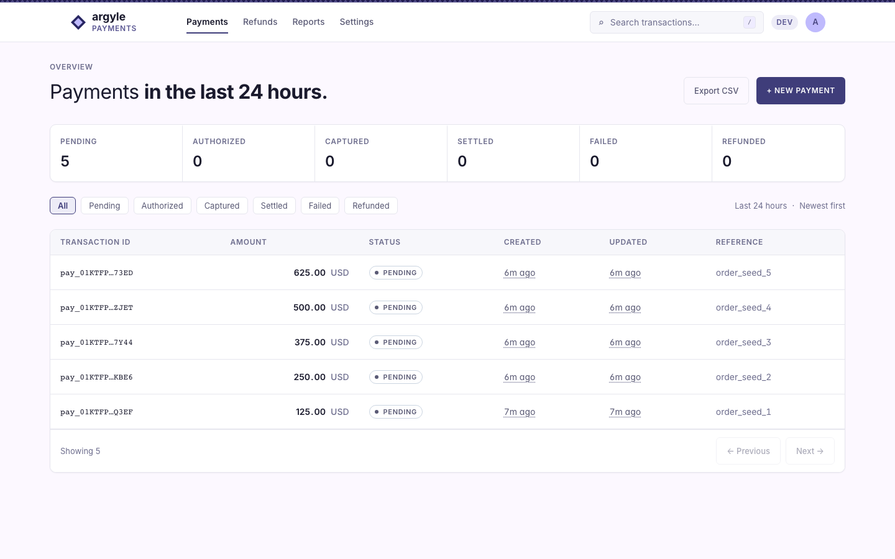
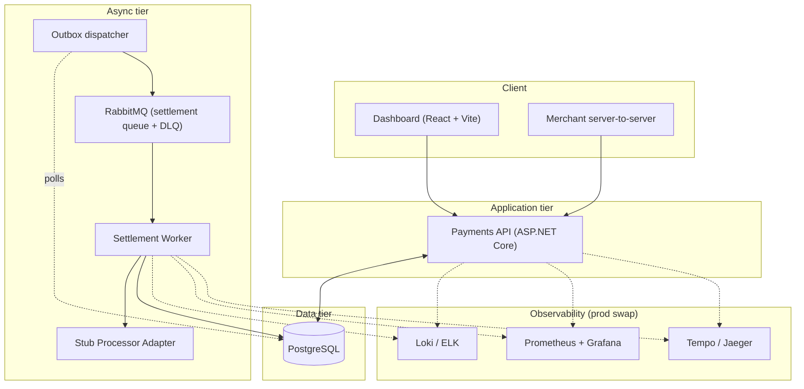

# Argyle — Payment Processing Platform

Argyle senior engineer take-home. An API for payment writes, a worker
that does settlement async, and an operator dashboard on top.

The full brief lives in [`Payment-Platform-Exercise.md`](Payment-Platform-Exercise.md).

## The dashboard



A single-page Vite + React app under [`frontend/`](frontend). Lists every
payment, filters by status, opens one to show the full event timeline.
Visual direction documented in
[ADR-0015](docs/adr/0015-visual-direction-swiss-data-dense.md) — Swiss /
data-dense, no UI kit, intentional.

---

## 1. Setup instructions

### What you need

- Docker Desktop (4.x or newer)
- `jq` for the demo script (`brew install jq`)
- `pnpm` for the frontend (`npm i -g pnpm@9`)

That's it for the smoke test. The .NET 10 SDK is only needed if you want
to run the test suite outside Docker.

### Bring everything up

```bash
git clone <this repo>
cd "Argyle - Payment Processing Platform"
./scripts/run.sh
```

That one command:

1. Builds and starts Postgres, RabbitMQ, the API, and the worker.
2. Waits for everything to report healthy.
3. Walks every API endpoint via [`scripts/demo.sh`](scripts/demo.sh) and
   asserts the responses (create, idempotent replay, capture, refund,
   list, detail with audit trail, cross-merchant isolation check).
4. Prints the dashboard launch command.

Add `--frontend` to also start the dashboard in the same shell, or
`--no-demo` to skip the endpoint walk.

### Launch the dashboard

```bash
cd frontend && pnpm install && pnpm dev
# http://localhost:5173/payments
```

You'll land on a list pre-populated with seeded payments at every
status (Pending, Authorized, Captured, Settled, Failed, Refunded).
Click a status chip to filter; click a row to see the full event
timeline. The list polls every 5s and the detail view polls every 3s
while a payment is in flight.

### Watch a payment go through its full lifecycle

With the dashboard open in one tab, run this in a new terminal:

```bash
./scripts/watch-lifecycle.sh
```

The script:

1. Picks one of the two seeded `Authorized` payments and prints its
   dashboard detail URL.
2. Counts down 5 seconds — open the URL in your dashboard tab now.
3. Issues `POST /v1/payments/{id}/capture`. The badge flips to
   `Captured` within ~1s (the API writes the payment row and an
   outbox row in the same database transaction, then returns).
4. The outbox dispatcher polls Postgres, finds the new row, publishes
   `SettlePayment` to RabbitMQ. The worker consumes, calls the stub
   processor, updates the payment to `Settled`, and appends the audit
   event. The badge flips to `Settled` ~1–3s after `Captured`.
5. Prints the full four-event timeline once the payment lands.

End-to-end in under 10 seconds. Reset with
`docker compose down -v && ./scripts/run.sh` — the two seeded
`Authorized` payments are consumed after one capture each.

### Run the tests

```bash
# Backend — 263 tests, integration suite uses Testcontainers (needs Docker)
cd backend && dotnet test

# Frontend — 40 unit/component + 2 Playwright E2E
cd frontend && pnpm test && pnpm e2e
```

Coverage snapshot in [`docs/coverage.md`](docs/coverage.md).

### Dev keys

Two merchants are seeded on first boot. Tokens stay the same across
restarts (the migration plants the SHA-256 hashes).

| Merchant   | Bearer token         |
| ---------- | -------------------- |
| Acme Corp  | `dev-key-mrc-acme`   |
| Pied Piper | `dev-key-mrc-pied`   |

### Useful URLs once the stack is up

| What                 | Where                                                       |
| -------------------- | ----------------------------------------------------------- |
| API                  | `http://localhost:8080`                                     |
| OpenAPI schema       | `http://localhost:8080/openapi/v1.json`                     |
| Readiness probe      | `http://localhost:8080/health/ready`                        |
| API metrics          | `http://localhost:8080/metrics`                             |
| Worker metrics       | `http://localhost:9090/metrics`                             |
| RabbitMQ management  | `http://localhost:15672` (`guest` / `guest`)                |
| Dashboard            | `http://localhost:5173/payments`                            |

---

## 2. Architectural overview

### The picture in one paragraph

A merchant sends an HTTP request to the API. The API validates it, stamps
an idempotency record so retries are safe, writes the payment row, and
returns. When that payment later moves money (capture), the API writes
the payment row *and* an outbox row in the same database transaction. A
background dispatcher reads outbox rows and publishes them onto RabbitMQ.
A separate worker process consumes those messages, talks to the (stubbed)
payment processor, updates the payment, and records what happened. The
dashboard reads the API to show operators the current state and the full
history of every payment.

### The picture as a diagram



Solid arrows are the live request and settlement path. Dotted arrows
are observability — Loki / Prometheus / Tempo are the production
target; today the API and Worker emit on `/metrics` and the OTel SDK
is wired to a console exporter that swaps to OTLP via one config line.
The Pending → Authorized step (called out in §6) is the missing edge
between create and capture in the live system.

### The pieces

| Piece              | Job                                                            | Why it's separate                                                     |
| ------------------ | -------------------------------------------------------------- | --------------------------------------------------------------------- |
| **API**            | Take requests from merchants, validate, persist, return.       | The API must stay fast and predictable; nothing slow runs in-band.    |
| **Worker**         | Process messages off the queue. Today: settle captured payments. | Failures here don't bring the API down. Retries don't block users.    |
| **Postgres**       | Source of truth for payments, events, idempotency, outbox.     | Payments need real transactions and unique constraints. Boring is good. |
| **RabbitMQ**       | Carry settlement work from API to worker.                      | Decouples timing. The API doesn't wait on the processor.              |
| **Dashboard**      | Operator view of every payment and its history.                | Reviewers, support, and on-call all need to see what happened, fast.  |

### Why we picked each tool

- **PostgreSQL.** Money requires ACID. Postgres gives us that plus
  unique constraints (the lock that makes idempotency work) and JSONB
  (the flexibility we'd otherwise reach for a document DB to get).
- **RabbitMQ via MassTransit.** Per-message ack, dead-letter queues,
  and a great .NET story. MassTransit is the abstraction so we can move
  to Azure Service Bus or SQS later without rewriting consumers.
  ([ADR-0009](docs/adr/0009-masstransit-over-raw-rabbitmq.md))
- **Vertical-slice + MediatR.** Each feature (`CreatePayment`,
  `CapturePayment`) is one folder with the command, validator, handler,
  and contract together. Adding or removing a feature touches one
  place, not five.
- **ULID identifiers.** Sortable like sequence numbers, unique like
  UUIDs, readable in logs, safe across regions. `pay_…` for payments,
  `evt_…` for events, `mrc_…` for merchants — the prefix tells you what
  you're looking at.
- **Outbox pattern.** When we capture a payment and need to enqueue
  settlement, both the DB row and the queue message have to land or
  neither does. Writing the queue message as a DB row inside the same
  transaction guarantees it. The dispatcher reads the outbox and
  publishes asynchronously. ([ADR-0008](docs/adr/0008-outbox-pattern-for-settlement.md))
- **Testcontainers.** Integration tests spin up real Postgres and real
  RabbitMQ in Docker. Mocked databases lie about migrations, value
  conversions, locking, and concurrency. Real containers find real bugs.
- **OpenTelemetry.** One vendor-neutral instrumentation stack covers
  traces, metrics, and logs. Switching from console output to Tempo /
  Mimir / Loki / Datadog in production is a one-line config change.
  ([ADR-0011](docs/adr/0011-opentelemetry-sdk-and-default-exporter.md))
- **Vite + React + TanStack Query.** The dashboard is read-mostly, so a
  proper server-state cache (TanStack Query) carries far more weight than
  any UI kit. We deliberately chose no Tailwind, no shadcn — opinionated
  CSS over template-looking output.
  ([ADR-0014](docs/adr/0014-frontend-stack.md), [ADR-0015](docs/adr/0015-visual-direction-swiss-data-dense.md))
- **Typed API client from OpenAPI.** The frontend's request and response
  shapes are generated from the API's schema. CI fails if anyone
  changes the API without regenerating, so the two can't silently drift.
  ([ADR-0016](docs/adr/0016-openapi-codegen-strategy.md))

### What we built into the platform's bones

- **Idempotency at every write.** `Idempotency-Key` is required on
  create, capture, and refund. Two requests with the same key + same
  body get the same response back; with a different body you get a
  loud `409`. The key is scoped per operation, so a merchant can reuse
  the same key for create and capture without collision.
  ([ADR-0007](docs/adr/0007-idempotency-keys-per-operation.md))
- **An audit trail you can trust.** Every state change writes a row to
  `payment_events` in the same transaction as the state change itself.
  No state can exist without its history. The dashboard's "event
  timeline" is just `payment_events` ordered by time.
  ([ADR-0006](docs/adr/0006-payment-events-same-transaction.md))
- **Optimistic concurrency.** Each payment row has a `version` column;
  the state machine bumps it on every transition. Two concurrent
  captures can't both succeed.
- **Structured logging with no secrets.** Every log line is single-line
  JSON. `card_token`, `cvv`, `pan`, and friends are redacted at every
  nesting depth by an enricher — they never reach a logger, and an
  integration test asserts so. ([ADR-0013](docs/adr/0013-log-redaction-deny-list.md))
- **Distributed traces across the queue boundary.** When the API
  publishes a settlement message, the trace context goes with it. Open
  the worker's processing span and you can walk back up to the original
  HTTP request. Every log line carries the same `trace_id`.
- **Cross-merchant isolation.** A merchant requesting another merchant's
  payment gets `404`, never `403`, never the payment body. Tested
  explicitly in the integration suite.

### Project layout

```
backend/
  src/
    PaymentPlatform.Api               # HTTP hosting, middleware, endpoint definitions
    PaymentPlatform.Application       # Features (vertical slices), validators, abstractions
    PaymentPlatform.Domain            # Payment + Merchant aggregates, state machine, value objects
    PaymentPlatform.Infrastructure    # EF Core, idempotency store, outbox dispatcher, stub processor
    PaymentPlatform.Messaging         # Queue contracts shared by API and Worker
    PaymentPlatform.Worker            # Background process: settlement consumer
    PaymentPlatform.Contracts         # Public DTOs returned by the API
  tests/
    PaymentPlatform.UnitTests         # Domain + handler + validator coverage
    PaymentPlatform.IntegrationTests  # Real Postgres + real RabbitMQ via Testcontainers
frontend/                             # Vite + React + TanStack Query dashboard
docs/
  adr/                                # 17 architecture decision records
  acceptance/                         # Walkthroughs captured against the live stack
scripts/
  run.sh                              # Bring up the whole stack + verify
  demo.sh                             # Walk every API endpoint
```

Reference direction: `Api → Application + Infrastructure + Contracts`,
`Worker → Application + Infrastructure + Messaging`,
`Application → Domain + Contracts`. No cycles.

---

## 3. Tradeoffs made

| Decision                  | What we chose                       | What we gave up                       | Why                                                                                                                  |
| ------------------------- | ----------------------------------- | ------------------------------------- | -------------------------------------------------------------------------------------------------------------------- |
| Database                  | PostgreSQL                          | NoSQL (Mongo, Dynamo)                 | Payments need ACID and unique constraints. JSONB still covers the flexibility we'd want.                              |
| Queue                     | RabbitMQ via MassTransit            | Azure Service Bus / SQS               | Runs identically on a laptop and in prod. Per-message ack fits settlement. MassTransit keeps the move-later option.   |
| Architecture style        | Vertical slice + MediatR            | Classic layered (Controllers/Services) | Higher cohesion. One folder per feature. Removing a feature touches one place, not five.                              |
| Outbox pattern            | Built                               | Direct queue publish from the handler | Direct publish races: DB commits but publish fails (or vice versa). Outbox closes the window.                         |
| Idempotency storage       | Postgres table                      | Redis-only                            | Redis is faster but loses data on crash. The DB is the source of truth. Redis goes in front later as a cache.        |
| Cursor pagination         | Built                               | Offset pagination                     | Offset gets slow and inconsistent on high-write tables. Cursor is correct and scales.                                 |
| Async workflow choice     | Settlement                          | Webhook delivery / reconciliation     | Settlement touches state, retries, audit, and traces — the most material to evaluate.                                 |
| Auth                      | Dev bearer (SHA-256 hashed)         | Full OAuth2                           | OAuth2 wiring is mechanical noise for a take-home. The seam (`ICurrentMerchant`) is identical to what OAuth2 plugs into. |
| Test infrastructure       | xUnit + Testcontainers              | Mocked DB and queue                   | Mocked infra lies. Real containers find real bugs and run fast on modern Docker.                                      |
| Tracing exporter          | Console + configurable OTLP         | Always-on Jaeger                      | Spinning up Jaeger adds friction. Instrumentation is real; the exporter is a one-line swap.                           |
| Frontend stack            | Vite + React + TanStack Query       | Next.js / Remix                       | The dashboard doesn't need SSR. Vite ships less, builds faster, and matches the take-home's scope.                    |
| CSS approach              | CSS Modules + design tokens         | Tailwind / shadcn / any UI kit        | Template-looking output is a real failure mode. Hand-rolled CSS with tokens looks intentional and ships small.        |

---

## 4. Assumptions

1. **Scale.** ~500 merchants, ~5M payments/month, 200 req/s peak, p99 < 300ms.
2. **One region, but no single-region assumptions in code.** IDs are
   globally unique (ULID), no in-process caches survive restart, the
   outbox is regional, idempotency is scoped per merchant. Bringing up
   a second region is a deploy concern, not a code change.
3. **No real card data.** `card_token` is an opaque stub. A real PCI
   vault is out of scope; the redaction discipline is what's being
   demonstrated.
4. **Currency.** Stored as integer minor units (cents). One currency
   per payment.
5. **Time.** All timestamps UTC. A `IClock` seam exists so tests can
   substitute a fixed clock.
6. **Tenancy.** Single-tenant deployment serving many merchants.
   Isolation is enforced in handler code via `merchant_id` filtering
   and tested explicitly.
7. **Stub processor.** A deterministic in-process implementation of
   `IPaymentProcessor`. The real adapter is the production swap.
8. **No real money.** Development exercise only.

A longer assumptions list (covering observability backends, frontend
deployment, etc.) lives in
[`docs/CODEMAPS/`](docs/) and the master plan.

---

## 5. Production considerations

What would change before this is something to bet revenue on. The
first item is the most important.

- **Multi-region active-passive within the US.** Primary serves all
  traffic; standby runs warm with replicated Postgres and an idle
  RabbitMQ broker. Idempotency is what makes failover safe — when
  merchants retry across the cut they either hit the replicated cached
  response or process fresh. Either way: no double-charges. This is
  why the brief asks about idempotency.
- **Postgres high availability.** Synchronous replication inside a
  region for HA, asynchronous across regions for DR. Automated
  failover via Patroni or the cloud-managed equivalent. Backups with a
  tested restore drill.
- **RabbitMQ clusters.** Three-node clusters per region, quorum queues
  for settlement. Cross-region replication isn't worth the operational
  cost — the standby region's broker stays quiet until failover.
- **Real auth.** OAuth2 client-credentials for merchants, OIDC for
  dashboard users, mTLS service-to-service. The `ICurrentMerchant`
  seam is the insertion point.
- **Secrets out of env vars.** Vault / Key Vault / Secrets Manager
  with per-region replicas.
- **Real observability backends.** OTLP collector → Tempo (traces) +
  Mimir (metrics) + Loki (logs), or the cloud-native equivalents.
  Trace ids carry a region tag for post-failover analysis.
- **Replace the stub processor.** A real adapter (Stripe, Adyen, or
  direct gateway) behind a Polly circuit breaker, with per-region
  routing if the processor is itself multi-region.
- **Migrations as a separate step.** `Database.Migrate()` at API
  startup is a dev affordance. Production runs migrations as a
  pre-deploy job, gated by an approval workflow, and applies them to
  the standby through replication — never run separately.
- **Rate limiting moves to Redis.** Per-instance in-memory limiting
  doesn't survive horizontal scale.
- **A real card tokenization vault** in a separate trust zone. The
  payment service never sees raw PAN.
- **Webhook delivery for merchants.** Reuse the outbox + worker pattern
  with HTTP delivery and per-merchant retry policy.
- **Chaos testing.** Game days that fail the DB primary, kill the
  broker, *and* trigger an actual region failover. Untested failover
  is broken failover.

---

## 6. Areas for future improvement

1. **An authorization path from `Pending` to `Authorized`.** The
   `Payment` aggregate has `Authorize()`, `Capture()`, `Settle()`,
   `Fail()`, and `Refund()` — the full state machine is there and
   tested. What's missing is an API caller for `Authorize()`. A
   payment created through the public API stays `Pending` until
   something else advances it, so `scripts/seed-demo-data.sh` plants
   demo rows at every status via direct SQL and `scripts/demo.sh`
   honestly prints "Skipping capture — payment is Pending" when it
   hits the gap. Three closure options, in increasing scope:
   (a) A Dev-only "auto-authorize on create" flag inside the create
   handler — simplest, but the integration suite's `TestDataBuilder`
   stages Pending payments and calls `Authorize()` itself, so flipping
   the flag on without isolating the test environment would break ~30
   tests; worth a focused pass, not a one-shot.
   (b) A real `POST /v1/payments/{id}/authorize` endpoint wired
   through a stub `IPaymentProcessor.AuthorizeAsync` (the existing
   `IPaymentProcessor` only handles settlement today). Closer to how
   a real processor adapter would attach.
   (c) Auto-authorize as a side effect of create, driven by a real
   processor callback after the create response returns. Production
   shape.
2. **Reconciliation.** A daily batch comparing our `payments` table
   against the processor's settlement report. Catches drift early.
3. **Partial captures and partial refunds.** The schema supports it;
   we'd add the flow.
4. **Multi-currency conversion** for cross-currency rollups.
5. **Merchant-scoped API keys with rotation.** Currently a single dev
   key per merchant.
6. **The dashboard's metadata transform caveat.** ADR-0017 documents
   that the API client converts every JSON key between snake_case and
   camelCase. Future surfaces that let merchants author free-form
   metadata keys need the transform to skip nested objects under known
   string-map fields.

---

## Further reading

- 17 architecture decision records under [`docs/adr/`](docs/adr/).
- The acceptance walkthroughs captured against the live stack live in
  [`docs/acceptance/`](docs/acceptance/).
- The visual direction for the dashboard:
  [`docs/visual-direction.md`](docs/visual-direction.md).
- Test coverage snapshot:
  [`docs/coverage.md`](docs/coverage.md).
